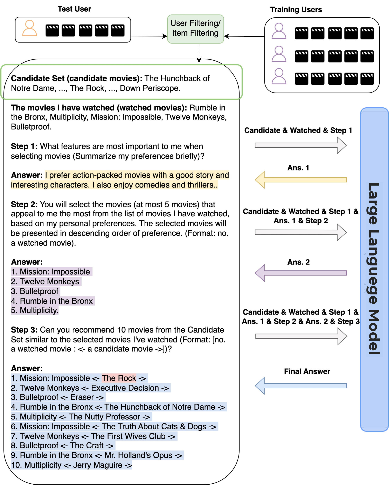

# Next-Item Recommendation with Zero-Shot Using LLM

The Next-Item Recommendation with Zero-Shot (NIR) method is a prompting strategy designed to guide LLMs in making next-item recommendations without training. It works first using an module to generate candidate items through user-filtering or item-filtering. Then, it applies a three-step prompting process: 
- Capture user's preference prompt.
- Selecte representative items prompt.
- Generate recommendations.

This approach enables LLM to provide recommendations without training but high performance.

---


---

## Dataset
NIR is evaluated on MovieLens 100K which contains 944 users and 1,683 movies.

---

## Project Guide
---
### 1. Installation.
Install all the necessary libraries, use pip to install:
```bash
pip install -r requirements.txt
```

----
### 2. Filling api key
You need to fill your api key and your LLM model name in the ./assets/openai.yaml file
```bash
api_keys:
- "your_api_key"
model:
  name: "model_you_use" GPT-4o/Groq/...
```

---
### 3. Test
Run `main.py` to follow the process and results of the model
```bash
python main.py
```

## Feedback
For feedbacks or issues about project please contact with me: 
```
ngochaoclhd@gmail.com
```
